# Mission 1

The initial credentials to connect to the machine

    Host: hades.hackmyvm.eu
    Port: 6666
    User: hacker
    Pass: begood!

Each time we will find a file `mission.txt` that gives us some what we need to in kind of puzzle.

    ################
    # MISSION 0x01 #
    ################

    ## EN ##
    User acantha has left us a gift to obtain her powers.

    ## ES ##
    La usuaria acantha nos ha dejado un regalo para obtener sus poderes.

I found also a file `readme.txt` that gives some informations like that the home of each user is in `/pwned/USER` and the file `flagz.txt` contain some kind of flag that we can insert in the official site to participate in the ranking.

From the content of `mission.txt` file we can assume that the next user is `acantha` and she left something for us that will give us her power. So let's first try `sudo -v` to see what we can run as who


I tried to search for a file that contains the word `gift` in its name.


I found an executable file called `gift_hacker`, which I could run because I belong to the `hacker` group. After executing it, I obtained a shell with the **UID of `acantha`**. However, I could not access her home directory because the shell still had the **GID of `hacker`**.  

So I decided To search for all the files owned by `acantha`, I used the following command:

```bash
find / -user acantha -type f 2>/dev/null
```

This search revealed an interesting file: `/pazz/acantha_pass.txt`, which contained the password for acantha.

| user | password | flag
|------|----------|-----
| acantha|mYYLhLBSkrzZqFydxGkn|^CaEuVJtJjaCwZtuuAFD^

# Mission 2

    ################
    # MISSION 0x02 #
    ################

    ## EN ##
    The user alala has left us a program, if we insert the 6 correct numbers, she gives us her password!

    ## ES ##
    La usuaria alala nos ha dejado un programa, si insertamos los 6 numeros correctos, nos da su password!

The executable `guess` prompts for a PIN code. If the correct PIN is entered, it reveals the password for the user `alala`. if not, it simply returns *"No"   

To extract this password, we can either analyze the binary with a disassembler or the `strings` command


| user | password | flag
|------|----------|-----
| alala|DsYzpJQrCEndEWIMxWxu|^gTdGmkwhDrCqKrDQpxH^

# Mission 3

    ################
    # MISSION 0x03 #
    ################

    ## EN ##
    User althea loves reading Linux help.

    ## ES ##
    A la usuaria althea le encanta leer la ayuda de Linux.

We need to find a way to read the file `althea_pass.txt` that's belong to the user and group althea. We have an executable `read` when excuting it we get the manuel page of the man command. But wait we can run commands from the man pages 


So `read` set the uid to that od the user `althea`. We can use that to read the file containing the password


| user | password | flag
|------|----------|-----
| althea|ObxEmwisYjERrDfvSbdA|^btDtPAPzSiXmoHItpqX^

# Mission 4

    ################
    # MISSION 0x04 #
    ################
    
    ## EN ##
    The user andromeda has left us a program to list directories.
    
    ## ES ##
    La usuaria andromeda nos ha dejado un programa para listar directorios.
    
I found a program called `lsme`. According to mission.txt, it is supposed to list directories. However, I wasn't able to list `/pwned/andromeda/` due to insufficient permissions. This suggests that the program sets the **UID** to that of `andromeda`, but leaves the **GID** unchanged, which restricts full access to the directory.


The program asks for an input and then passes it directly to the `ls` command. The issue is that no validation or sanitization is performed on the input, which allows us to chain additional commands and potentially execute arbitrary commands.


| user | password | flag
|------|----------|-----
| andromeda|OTWGTbHzrxhYFSTlKcOt|^xzsHGrOeNctIZLGKzWq^

# Mission 5

    ################
    # MISSION 0x05 #
    ################
    
    ## EN ##
    The user anthea reminds us who we are.
    
    ## ES ##
    La usuaria anthea procura que no olvidemos quien somos.

This time we have a program  called  `uid` executing it with parm or withou them returns the result of the `id` commmand with the uid set to anthea. We have also like before a file that contains the password for `anthea`. 


Since the program call the command `id`, I create a **symlink** to the command `/bin/bash` with the name `id` and I add the `/tmp` dir in the variable `PATH`. This gives a shell with the uid of `anthea`.


| user | password | flag
|------|----------|-----
| anthea|yWFLtSNQArEBTHtWgkKd|^AcFLuAjhydNKIkPoFLL^

# Mission 6

    ################
    # MISSION 0x06 #
    ################
    
    ## EN ##
    User aphrodite is obsessed with the number 94. 
    
    ## ES ##
    La usuaria aphrodite esta obsesionada con el numero 94.

The program `obsessed` has weird behaviour. It takes an input from the environement variable MYID and return weird output.


`strings` doesn't work. But it looks like it's about ascii(a encodes as 97 in ascii); so I need to put something that gives in ascii 94.


| user | password | flag
|------|----------|-----
| aphrodite|HPJVaqRzieKQeyyATsFv|^fmPlsDByrwmEpRAKgeP^

# Mission 7

    ################
    # MISSION 0x07 #
    ################
    
    ## EN ##
    The user ariadne knows what we keep in our HOME.

    ## ES ##
    La usuaria ariadne sabe que es lo que guardamos en nuestro HOME.

This program(`homecontent`) execute the following `/bin/ls $HOME`. So I use the variable HOME to chain commands.


| user | password | flag
|------|----------|-----
| ariadne|iNgNazuJrmhJKWixktzk|^FuGFaFNhtKNxUInxAtd^

# Mission 8

    ################
    # MISSION 0x08 #
    ################
    
    ## EN ##
    The user arete lets us use cp on her behalf. 
    
    ## ES ##
    La usuaria arete nos deja usar cp en su nombre.

Using `sudo -l` I confirm the `mission.txt` statement


Now the task is clear and straightforward: access the home directory of `arete` and copy interesting files to a location where we have read permissions. The main question is what exactly needs to be copied. From previous missions, I know that in every home directory there is a file called `flagz.txt` which contains the flag (not the password). This is not an issue, since submitting the flag on the platform will reveal the corresponding password for that user.


| user | password | flag
|------|----------|-----
|arete|QjrIovHacmGWxVjXRLmA|^qmrrbGUXLTqLFDyCDlx^

# Mission 9

    ################
    # MISSION 0x09 #
    ################
    
    ## EN ##
    The user artemis allows us to use some binary on her behalf. Its a gift... 
    
    ## ES ##
    La usuaria artemis nos permite usar algun binario en su nombre. Es un regalo...


/sbin/capsh is a handy wrapper for certain types of  capability testing and environment creation

It can be used to run a command.


| user | password | flag
|------|----------|-----
|artemis|HIiaojeORLaJBVSPDDCZ|^SegGdzPgnNdGAmKjnsa^

# Mission 10

    ################
    # MISSION 0x10 #
    ################

    ## EN ##
    We need /bin/bash so that the user asia gives us her password. 

    ## ES ##
    Necesitamos /bin/bash para que la usuaria asia nos de su password.

When I run `restricted`, I directly obtain the password, but I’m not sure what the real purpose of this mission is. Maybe the idea is that I’m getting a regular Bash shell, while they actually expect us to spawn a different type of shell program.

| user | password | flag
|------|----------|-----
|asia|djqWtkLisbQlrGtLYHCv|^ngXdULWFWKCGtgxAQNv^

# Mission 11

    ################
    # MISSION 0x11 #
    ################

    ## EN ##
    The user asteria is teaching us to program in python. 

    ## ES ##
    La usuaria asteria nos esta enseñando a programar en python.


python is runnable as the user asteria. We can exploit this to spawn a shell as `asteria`.


| user | password | flag
|------|----------|-----
|asteria|hawMVJCYrBgoDAMVhuwT|^xSRhIftMsAwWvBAnqNZ^

# Mission 12

    ################
    # MISSION 0x12 #
    ################

    ## EN ##
    The user astraea believes in magic. 

    ## ES ##
    La usuaria astraea cree en la magia.


The challenge is based on a simple PHP application that compares the hash of the input provided in the `pass` parameter with the hash of the real password of `astraea`.  
If the two match, the application returns the password in cleartext.  

They also mentioned something about *magic*, which immediately made me think of the **magic hash attack**.  
This vulnerability occurs when PHP performs a *loose comparison* (`==` instead of `===`), allowing certain specially crafted hash values (like those starting with `0e...`) to be interpreted as `0` and thus bypass the check.

I found a repo that contains a list of strings that gives magic hashes (`md5("QLTHNDT")=0e405967825401955372549139051580`)


| user | password | flag
|------|----------|-----
|astraea|nZkEYtjvHElOtupXKzTE|^nqTHTzMzDPDJrKPCfVR^

# Mission 13

When trying to connect using ssh as the user `astraea`, the connection closed immediately.  
This means we need to look for another service running on the machine to connect to.

Since tools like `nmap`, `netstat`, or `ss` were not available, I decided to use a simple Python-based port scanner.  
I found one here: [ahervias77/portscanner.py](https://github.com/ahervias77/portscanner/blob/master/portscanner.py).

Here’s the scan in action:


An FTP server is running on the machine.


In the ftp server I found three files: the flag for the user `astraea`, the mission.txt and a file containing the password for the user `atalanta`.

    ################
    # MISSION 0x13 #
    ################

    ## EN ##
    The user atalanta has done something with our account. 

    ## ES ##
    La usuaria atalanta ha hecho algo con nuestra cuenta.


| user | password | flag
|------|----------|-----
|atalanta|mUcSNQlaXtwSvGcgeTYZ|^XXZbDJTQQWCHJWTGeOw^

# Mission 14

    ################
    # MISSION 0x14 #
    ################

    ## EN ##
    User athena lets us run her program, but she hasn't left us her source code.

    ## ES ##
    La usuaria athena nos deja ejecutar su programa, pero no nos ha dejado su codigo fuente.

The source code of the executable `weird` shows that the program simply dumps the content of `/var/lib/me` and writes it into the file specified by the environment variable `$HOME`. Then it checks the file’s owner, and if the owner is not the user `atalanta`, the program modifies its permissions by removing read access for both group and others while adding write access for the group.


| user | password | flag
|------|----------|-----
|athena|kmQMpZsXgOsnzGReRcoV|^oGwmbNYdtHwJgznZdur^

# Mission 15

    ################
    # MISSION 0x15 #
    ################

    ## EN ##
    User aura lets us use her new script.

    ## ES ##
    La usuaria aura nos deja utilizar su nuevo script.


We can’t read the current script, but we were provided with an older version that gives us some insight into its behavior.

    #!/bin/bash
    echo "What?"
    read hackme
    #Secure the condition!
    #if [[ $hackme =~ "????????" ]]; then
    #exit
    #fi
    #Add newest Aura pass!
    #$hackme AURANEWPASS 2>/dev/null
    
The script prompts for an input, stores it in the `hackme` variable, and then performs a series of checks on it.


| user | password | flag
|------|----------|-----
|aura|TiqpedAFjwmVyBlYpzRh|^YFMNmPnlKNpnWiYOhYy^

the script seems to use this line `[[ $hackme == *"e"* || $hackme == *"o"* || $hackme == *"?"* ]]` to checks if the variable `hackme` contains the letter `e`, the letter `o`, or the character `?`.

# Mission 16

    ################
    # MISSION 0x16 #
    ################

    ## EN ##
    User aegle has a good memory for numbers.

    ## ES ##
    La usuaria aegle tiene buena memoria para los numeros.

The `number` program repeatedly prompts for a number, verifies it, and continues this process until eventually printing the password.

I use this script to bruteforce the numbers

```bash
#!/bin/bash

test=""
r=0

while true; do
    r=$((r+1))
    for i in $(seq 9); do
        count=$(echo -e "$test$i\n" | /pwned/aura/numbers | grep -c "OK")
        if [ "$count" -eq "$r" ]; then
            test="$test$i\n"
            echo "test = $test"
            break
        fi
   done
done
```
This Bash script builds a sequence of numbers one by one, feeding each candidate into `/pwned/aura/numbers` and appending it to the sequence only if the program returns the expected number of `"OK"` messages.


But the program stops at the number `9`. After debugging, I discovered that it behaves strangely when testing `1`: instead of returning a count of `8`, it returns `11`. After multiple attempts to resolve the issue, I modified the condition from `"$count" -eq "$r"` to `"$count" -ge "$r"`, allowing it to also match cases where the count is greater than `r`.


I got all the numbers except for the last one because, when entering the correct final number, the program returns the password instead of `"OK"` as it did for the previous numbers.

| user | password | flag
|------|----------|-----
|aegle|YRturIymmHSdBmEClEGe|^XCwOqgVvWpDVwPVVUJa^

# Mission 17 

    ################
    # MISSION 0x17 #
    ################

    ## EN ##
    User calliope likes to have her things looked at.

    ## ES ##
    A la usuaria calliope le gusta que le miren sus cosas.


| user | password | flag
|------|----------|-----
|aegle|IlhyWxZuqIHAuqVOpXfQ|^rFWOMwBJDidqSNtEJGJ^

# Mission 18 

    # Mission 18

    ################
    # MISSION 0x18 #
    ################

    ## EN ##
    The user calypso often uses write to communicate.

    ## ES ##
    La usuaria calypso suele usar write para comunicarse.

A program named `writeme` was identified. Upon execution, the following message appeared:


They something about `write`. The latter allows you to communicate with other users, by copying lines from your terminal to theirs. To permit incoming messages from other users, the command mesg y is executed.


| user | password | flag
|------|----------|-----
|calypso|TAMYefoHcCPmexwImodo|^pssqdorRTYuTKuQBOYd^

# Mission 19 

    ################
    # MISSION 0x19 #
    ################

    ## EN ##
    User cassandra always wanted to be on TV.

    ## ES ##
    La usuaria cassandra siempre quiso salir en la TV.

The provided WAV file contained unusual audio. Analysis suggested the use of SSTV (Slow-Scan Television), a method for transmitting static images via radio. Decoding with an SSTV tool revealed the hidden content.


| user | password | flag
|------|----------|-----
|cassandra|CKzlnvmHQz|^lntvcYNlazEljOyZYKz^

# Mission 20

    ################
    # MISSION 0x20 #
    ################

    ## EN ##
    User cassiopeia sees the invisible. 

    ## ES ##
    La usuaria cassiopeia ve lo invisible.

The file here.txt contains Base64-encoded data. Decoding it produces incomplete text along with irregular white spaces. Upon further investigation, I discovered that the file likely uses whitespace steganography.


`stegsnow` is then used to extract the hidden data


| user | password | flag
|------|----------|-----
|cassiopeia|gRqFnHblmZVZSfegPLvO|^GyWbcpEpqMsqMsjilzX^

# Mission 21

    ################
    # MISSION 0x21 #
    ################

    ## EN ##
    User clio hates spaces. 

    ## ES ##
    La usuaria clio odia los espacios.


We have the read permission 

```bash 
#!/bin/bash
echo File to compare:!
read differences
IFS=0 read file1 file2 <<< "$differences"

if [[ "$differences" =~ \ |\' ]]
then
   echo "No spaces!!"
else
/usr/bin/diff $file1 $file2
fi
```

So instead of the default space IFS the program uses 0


| user | password | flag
|------|----------|-----
|clio|cqJqRPaUtuoUYXbaxnZq|^XUJbvPwAZYgoUgkpeSv^

# Mission 22

    ################
    # MISSION 0x22 #
    ################

    ## EN ##
    The user cybele uses her lastname as a password.

    ## ES ##
    La usuaria cybele usa su apellido como password.


| user | password | flag
|------|----------|-----
|cybele|UICacOPmJMWbKyPwNZod|^bTsTIOmJELcaxEiIaCA^

# Mission 23

    ################
    # MISSION 0x23 #
    ################

    ## EN ##
    User cynthia sees things that others dont.

    ## ES ##
    La usuaria cynthia ve cosas que el resto no ven.

I discovered a PNG image and tested it with several steganography tools such as **steghide**, **binwalk**, and others, but none revealed any hidden data.  Finally, by analyzing it with [StegOnline](https://georgeom.net/StegOnline/upload) and inspecting the **bit planes**, I found the password hidden in the **Red 0** plane.  


| user | password | flag
|------|----------|-----
|cynthia|QHLjXdGSiRShtWpMwFjj|^ZRSCKeYYlHkCEiHsEOI^

# Mission 24 

    ################
    # MISSION 0x24 #
    ################

    ## EN ##
    User daphne once told us: Gemini? gem-evil.hmv? WTF?

    ## ES ##
    La usuaria daphne nos dijo una vez: Gemini? gem-evil.hmv? WTF?

googling `gemini` and digging deeper to escape information about `gemini model from google`. I found out that Gemini is an application-layer internet communication protocol for accessing remote documents that uses port **1965** and similar to HTTP.

When scanning the target for open ports, I identified **1965**, which confirmed that the machine is running the **Gemini protocol**.


I use `ssh -p 6666 acantha@hades.hackmyvm.eu -L 1965:127.0.0.1:1965` to forward all requests from `localhost:1965` through SSH to `hades.hackmyvm.eu` on port `1965`.


| user | password | flag
|------|----------|-----
|daphne|EkdtKuXCJjlFKFpKgddX|^ieOhnUKZlYZSSrIPgaJ^

# Mission 25

    ################
    # MISSION 0x25 #
    ################

    ## EN ##
    The user delia has a good memory, she only has to see her password for a few seconds to remember it.

    ## ES ##
    La usuaria delia tiene buena memoria, solo tiene que ver unos segundos su password para recordarlo.

```bash
#!/bin/bash
#OUTPUT="PASSWORD_DELIA" <-- UPDATE IT!
secretfile=$(mktemp /tmp/XXX)
chmod 664 "$secretfile"
exec 5>"$secretfile"
echo $OUTPUT >&5
sleep 0.01
rm "$secretfile"
```

This script briefly writes the password for the user `delia` into a temporary file, then deletes it almost immediately. The file’s name is generated with three random characters, so its exact name is unpredictable. Even if we try to read all files with three-character names in `/tmp`, the password won’t be found because the file is removed almost instantly. Tried to print the content of all the files in `/tmp` but I failed.

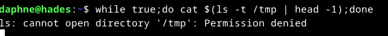

The user `daphne` can run a script called `new.sh` as the user `delia`

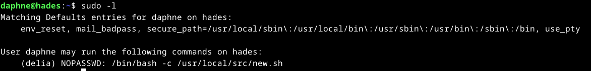

Attempting to retrieve the PID of the running program and display the content of its file descriptor 5 using `cat /proc/<pid>/fd/5`. However, this fails because the current user does not have the required permissions.  

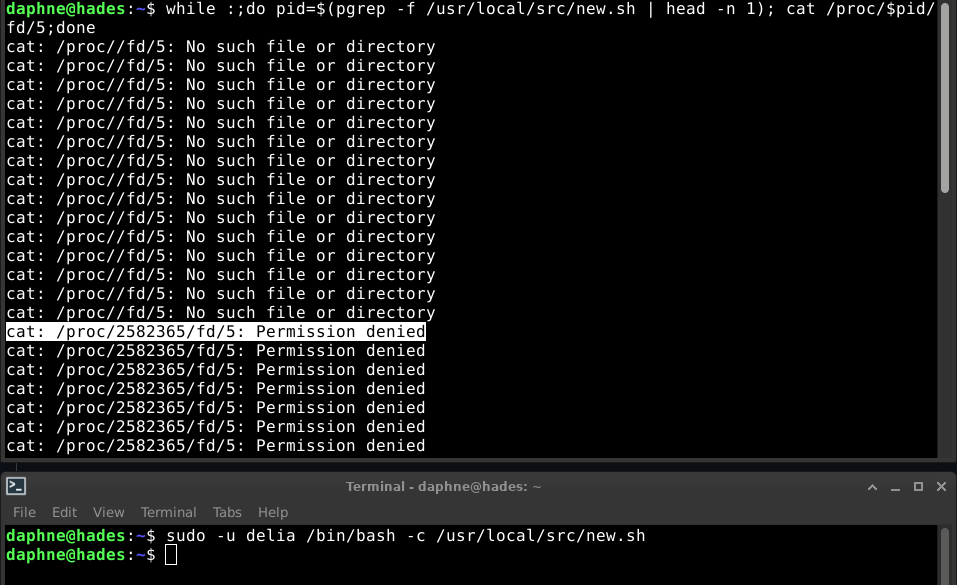

The program uses `mktemp` to create files with random three-character names. If a directory or file with the generated name already exists, mktemp tries another combination until it succeeds. I use the following bash script to create every possible files in the /tmp folder(26 for lowecase + 26 for uppercase + 10 for numbers)^3 = 63^3 = 238328 possible combinations.

```bash
chars=( {a..z} {A..Z} {0..9} )
for a in "${chars[@]}"; do
  for b in "${chars[@]}"; do
    for c in "${chars[@]}"; do
      > "/tmp/${a}${b}${c}"   # fast create/truncate
    done
  done
done
```
Reruning the script gives this

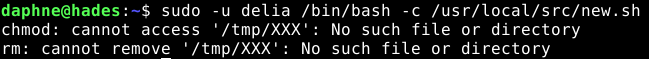

I try delete one file and run it again 

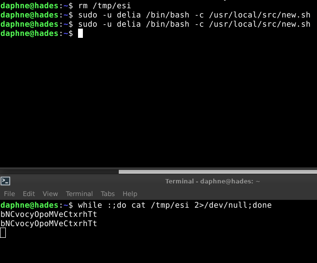


| user | password | flag
|------|----------|-----
|delia|bNCvocyOpoMVeCtxrhTt|^QfaHPyEqMepsOdMxQCQ^

# Mission 26

Connecting as the new user gives us a weird shell. 

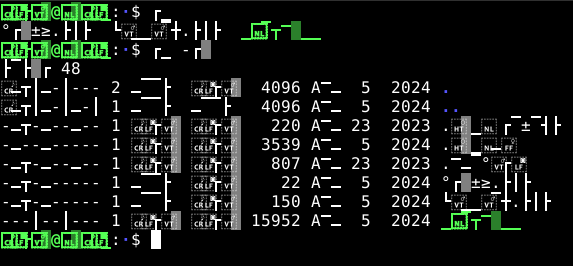

`scp` helps to get the content of mission.txt and flagz.txt.

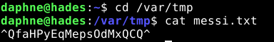

    ################
    # MISSION 0x26 #
    ################

    ## EN ##
    User demeter reads in another language.

    ## ES ##
    La usuaria demeter lee en otro idioma.

So, the user Demeter is using a different language. I searched the web and found information about character banks. Currently, the terminal emulator is using a box-drawing character set, but I need it to use the ASCII set. This can be achieved with `printf '\033(B'.

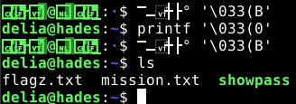

now we run the shopass program.

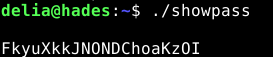

| user | password | flag
|------|----------|-----
|demeter|FkyuXkkJNONDChoaKzOI|^JiviWHRVRZLSfjBuwAi^

# Mission 27 

    ################
    # MISSION 0x27 #
    ################
    
    ## EN ##
    The user echo permute.
    
    ## ES ##
    La usuaria echo permuta.

demeter can run `ptx` as echo 

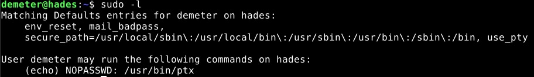

from the man page 

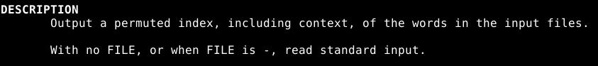

So we can simply use it to run the content of /pwned/echo/flagz.txt

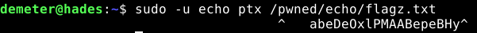

| user | password | flag
|------|----------|-----
|echo|GztROerShmiyiCIlfepG|^abeDeOxlPMAABepeBHy^

# Mission 28

    ################
    # MISSION 0x28 #
    ################
    
    ## EN ##
    The user eos can see the sounds.
    
    ## ES ##
    La usuaria eos puede ver los sonidos.

We're given a wav file. I copy it to my machine for analysis.

Using audacity, I draw the spectogram 

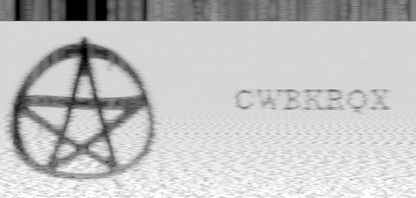

| user | password | flag
|------|----------|-----
|eos|CWBKRQX|^OsoLytPlXEjvinhCNyy^

# Mission 29

    ################
    # MISSION 0x29 #
    ################
    
    ## EN ##
    The user gaia is very careful saving her passwords.
    
    ## ES ##
    La usuaria gaia es muy precavida guardando sus passwords.

They gave us a kbdx file. googling it I found that a KDBX file is a password database created by KeePass Password Safe, a free password manager for Windows. It stores an encrypted database of passwords that can be viewed only using a master password set by the user.

The file is protected with a password. So I downloaded it to crack it offline using john

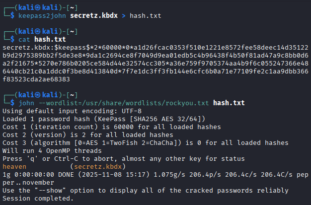

Using the cracked password I retrieved the password for the user `gaia`.

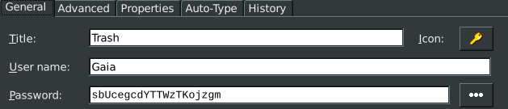

| user | password | flag
|------|----------|-----
|gaia|sbUcegcdYTTWzTKojzgm|^NWelryzwJowjEaDWEiY^

# Mission 30

    ################
    # MISSION 0x30 #
    ################
    
    ## EN ##
    User halcyon wants all the powah.
    
    ## ES ##
    La usuaria halcyon quiere todo el powah.

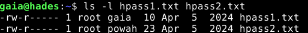

We are able to read hpass1.txt, but hpass2.txt is not accessible. However, if we were members of the powah group, we would gain read access to hpass2.txt, as the file’s group permissions would allow it.

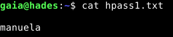

`gpasswd` is used to manage groups via `/etc/group` and `/etc/gshadow`. However, adding members to a group with gpasswd requires being a group administrator, which is why it does not work for my user.

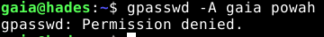

To use `newgrp` without a password the user should be a member of that group (secondary group). It's not the case in this situation.(for more info about newgrp : [newgrp](https://www.computerhope.com/unix/unewgrp.htm))

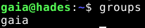

When we attempt it, the system prompts for a password. I tried the password found in hpass1.txt, and it succeeded.

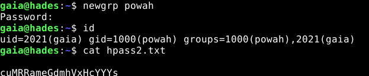


| user | password | flag
|------|----------|-----
|halcyon|cuMRRameGdmhVxHcYYYs|^YBkkiwOiBVdzLnxXPdU^

# Mission 31

    ################
    # MISSION 0x31 #
    ################
    
    ## EN ##
    The user hebe has one 'magicword' to get her password using http://localhost/req.php 
    
    ## ES ##
    La usuaria hebe tiene una 'magicword' para obtener su password usando http://localhost/req.php

using Curl we get "No". Trying with a `magicword` as a param we get the same response.

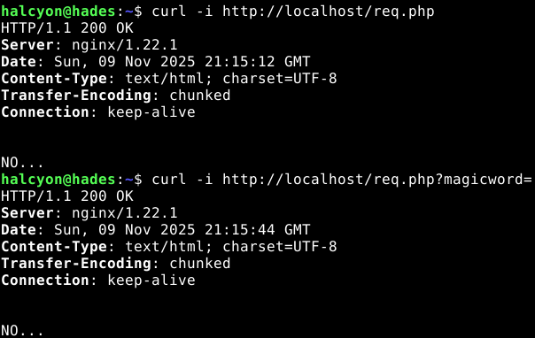

So I keep testing for values of `magicrowd`. 

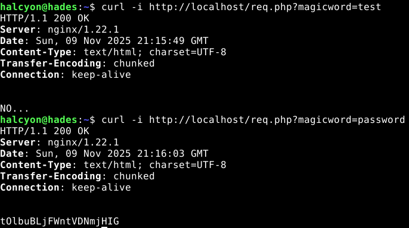

| user | password | flag
|------|----------|-----
|hebe|tOlbuBLjFWntVDNmjHIG|^BAWnwGCghvcBbbRcZVd^

# Mission 32

    ################
    # MISSION 0x32 #
    ################
    
    ## EN ##
    User hera refuses to use Discord, she prefer an older and open source service.
    
    ## ES ##
    La usuaria hera se niega a usar Discord, prefiere un medio mas antiguo y abierto.

using a port scanner I discover an open ports related to IRC.

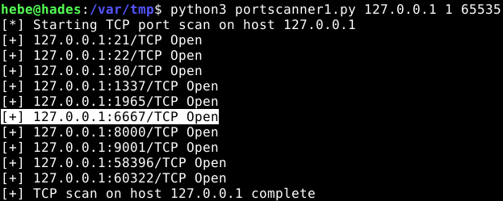

Connecting to it using nc then registring following the instruction [here](https://www.verylazytech.com/network-pentesting/irc-ports-194-6667-6660-7000). Now we get access to an IRC server.

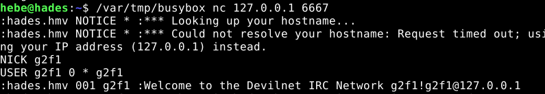

We move to test some commands. Listing the existing channels reveals the password for the user hera.

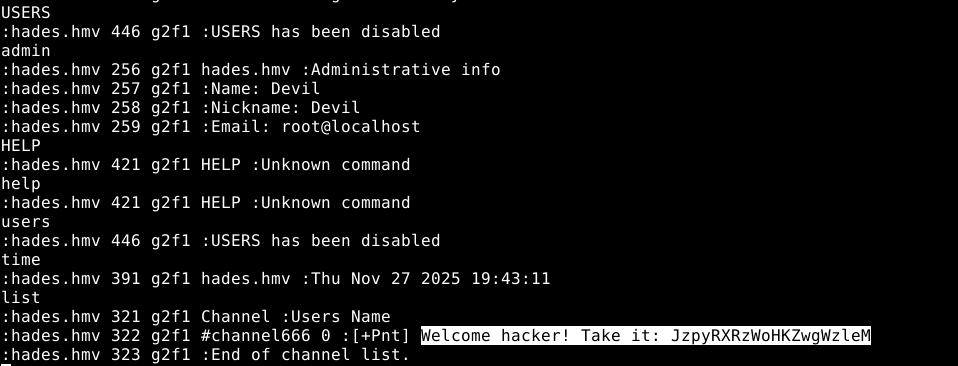

| user | password | flag
|------|----------|-----
|hera|JzpyRXRzWoHKZwgWzleM|^GaIAyNGsSRYClSuzVLX^

# Mission 33

    ################
    # MISSION 0x33 #
    ################
    
    ## EN ##
    User hermione would like to know what hera was doing. 
    
    ## ES ##
    A la usuaria hermione le gustaria saber que hacia hera.

Using history we get a list of what the user hera was doing in the cli, we found a hidden flag. 


But the password for hermione is stored in the file `/usr/hera`

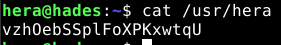

| user | password | flag
|------|----------|-----
|hermione|vzhOebSSplFoXPKxwtqU|^dLcEkLNgdDvOlxtPhjh^

# Mission 34

    ################
    # MISSION 0x34 #
    ################
    
    ## EN ##
    User hero only talks to some groups.
    
    ## ES ##
    La usuaria hero solo se habla con algunos grupos.

We found an executable that verify the current gid of the user trying to run it. If the gid match 6666 the program will probably print the password if not it said that it only trust the group 6666. Checking the groups of the current user I found that I'm a member of the group beast whose gid is 6666. So I use `newgrp` to change my primary group then I run the program 

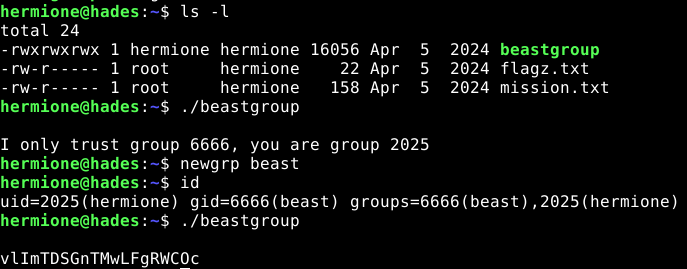

| user | password | flag
|------|----------|-----
|hero|vlImTDSGnTMwLFgRWCOc|^KUEUoYgCWKlUTpywGeK^

# Mission 35

    ################
    # MISSION 0x35 #
    ################
    
    ## EN ##
    User hestia likes to keep the screen clean.
    
    ## ES ##
    A la usuaria hestia le gusta mantener la pantalla limpia.

A program with the setuid set is given.

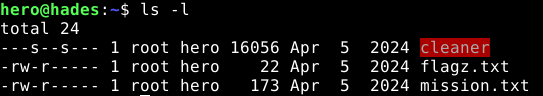

When I run it, I discover that i will be added to another group(her0) and it become my principal group.

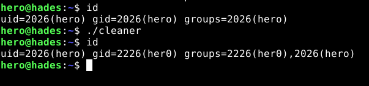

I search for all files that has her0 as group, and this gives us the password for the next user.

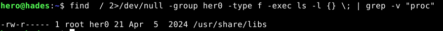

| user | password | flag
|------|----------|-----
|hestia|opTNnZQAuFJsauNPHXVq|^mIZKIDJYZQDogbkwRGy^

# Mission 36

    ################
    # MISSION 0x36 #
    ################
    
    ## EN ##
    User ianthe has left us her own less.
    
    ## ES ##
    La usuaria ianthe nos ha dejado su propio less.

We were given a binary named **`less`**, which is clearly not the real `less` command. I noticed that it has the **setuid** bit set for the next user. Because of that, this custom `less` binary runs with the UID of the user **ianthe**.

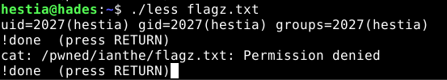

Running `id` from inside the custom `less` binary shows that it still uses my own UID. The program maybe drops its elevated privileges. We can't also read **/pwned/ianthe/flagz.txt** because it's owned by `root`, not `ianthe`. I search for files owned by ianthe 

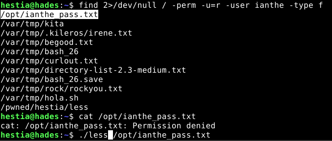

| user | password | flag
|------|----------|-----
|ianthe|DphioLqgVIIFclTwBsMP|^SdoibXIPAdqIdzDrYId^

# Mission 37

    ################
    # MISSION 0x37 #
    ################
    
    ## EN ##
    Seems that irene is developing an auth system http://localhost/irene_auth.php
    
    ## ES ##
    Parece que irene esta desarrollando algun sistema de autenticacion http://localhost/irene_auth.php
    
They gave us this prototype for the real php file

```php
<?php
    session_start();
    $allowed_domains = array("hackmyvm.hmv");
    if (in_array($_SERVER['HTTP_ORIGIN'], $allowed_domains)) {
        header("Access-Control-Allow-Origin: {$_SERVER['HTTP_ORIGIN']}");
        header("Access-Control-Allow-Credentials: true");
        header("Access-Control-Allow-Methods: GET, POST, OPTIONS");
        header("Access-Control-Allow-Headers: Origin, X-Requested-With, Content-Type, Accept, Authorization");

        $_SESSION['loggedin'] = isset($_SESSION['loggedin']) ? $_SESSION['loggedin'] : false;

        if (isset($_POST['username']) && isset($_POST['password'])) {
            if ($_POST['username'] == 'admin' && $_POST['password'] == 'xxxxx') {
                $_SESSION['loggedin'] = true;
                header('Location: index.php');
            } else {
                $error = 'Invalid username or password';
            }
        }

        if ($_SESSION['loggedin'] == true) {
            $flag = "XXXXX";
            echo $flag;
        } else {
            echo '
            <form method="post" action="">
                <label for="username">Username:</label>
                <input type="text" id="username" name="username" required>
                <br>
                <label for="password">Password:</label>
                <input type="password" id="password" name="password" required>
                <br>
                <input type="submit" value="Login">
            </form>
            ';

            if (isset($error)) {
                echo '<p>' . $error . '</p>';
            }
        }
    } else {
        header("HTTP/1.1 403 Forbidden");
    }
?> 

```

The PHP script implements a simple login system with session handling and CORS protection. It only allows requests from the domain `hackmyvm.hmv`. Users must provide the correct credentials to set `$_SESSION['loggedin']` to `true`. Once logged in, the script reveals a flag.

I try the password admin and it works.

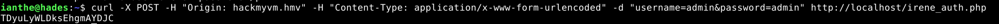

| user | password | flag
|------|----------|-----
|irene|TDyuLyWLDksEhgmAYDJC|^ZACnrFArVosWGJNfPkN^

# Mission 38

    ################
    # MISSION 0x38 #
    ################
    
    ## EN ##
    User iris hates some characters.
    
    ## ES ##
    La usuaria iris odia algunos caracteres.

They provided us with a program that filters the user input and then executes a command with it, as long as the input doesn’t contain any forbidden characters.

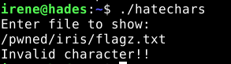

After testing I found that the program don't accept the following charachters : a,e,o,.,*,t. I tried to use "?" to match the remaining characters but it can't read the `flagz.txt` in the home directory of `iris`, but it can read it from the currrent directory. So the globbing works and maybe there is no file `flagz.txt` in that directory 


Now i search for files owned by `iris` and are ready to read by her.

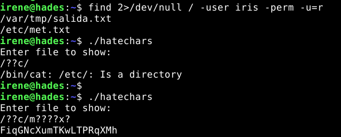

| user | password | flag
|------|----------|-----
|iris|FiqGNcXumTKwLTPRqXMh|^xXcULtRBXxcHIUVxtXT^

# Mission 39

    ################
    # MISSION 0x39 #
    ################
    
    ## EN ##
    User kore likes to navigate! 
    
    ## ES ##
    A la usuaria kore le gusta navegar!

This find reveal that the user `kore` uses w3m which is a free and open source text-based web browser. 

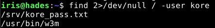

So we use it to read the content of files containing the password for the user `kore`.

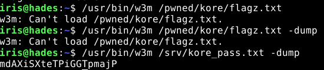

| user | password | flag
|------|----------|-----
|kore|mdAXiSXteTPiGGTpmajP|^FEYohPSMjrxKzdLNxkQ^

# Mission 40

    ################
    # MISSION 0x40 #
    ################
    
    ## EN ##
    User leda always wanted to edit videos.
    
    ## ES ##
    La usuaria leda siempre quiso editar videos.

I found that the `ffmpeg` has the setuid bit set to the user `leda`. 

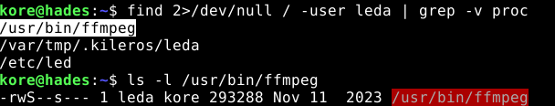

So I google for a way to read files belonging to leda with it. 

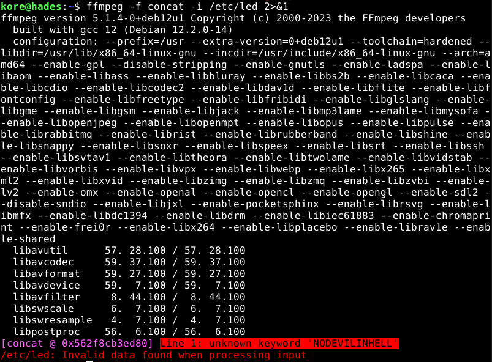

| user | password | flag
|------|----------|-----
|leda|NODEVILINHELL|^wHseqgzsZUNyruSnxnl^

# Mission 41

    ################
    # MISSION 0x41 #
    ################
    
    ## EN ##
    User maia hears everything. 
    
    ## ES ##
    La usuaria maia lo oye todo.

We can run `sudo` as the user **maia**.

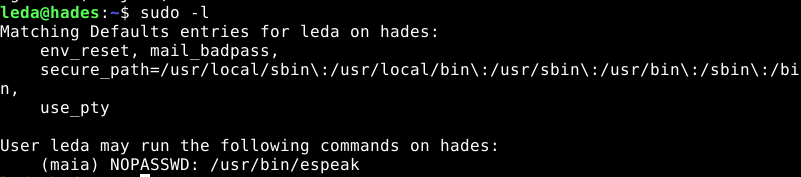

`espeak` is a Linux command-line tool that converts text into speech.

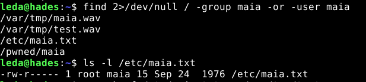

I suspected that `/etc/maia.txt` contained the password, so I tried using `espeak` to convert the text file into a WAV audio file and then transcribe its content using AI.

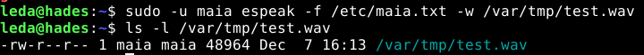

Unfortunately, I wasn’t able to retrieve anything meaningful.

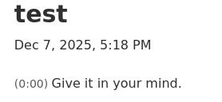

So I changed my approach. The following command got the job done.

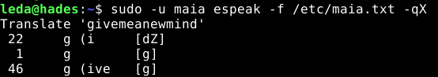

| user | password | flag
|------|----------|-----
|maia|GIVEMEANEWMIND|^GWsDBTCiXdZDNtRzVGt^

# Mission 42

    ################
    # MISSION 0x42 #
    ################
    
    ## EN ##
    It seems that user nephele has broken the image.
    
    ## ES ##
    Parece que la usuaria nephele ha roto la imagen.

They provided us with a corrupted PNG file. I downloaded it to analyze it on my machine. Using **ghex**, I reconstructed the file header and successfully recovered the image.

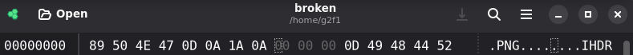

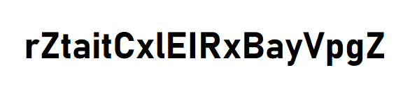

| user | password | flag
|------|----------|-----
|nephele|rZtaitCxlEIRxBayVpgZ|^oSiWofNrDjNWbcAqMAx^

# Mission 43 
    
    ################
    # MISSION 0x43 #
    ################
    
    ## EN ##
    The nyx user visits some websites that we do not know.
    
    ## ES ##
    La usuaria nyx visita algunas webs que no conocemos.

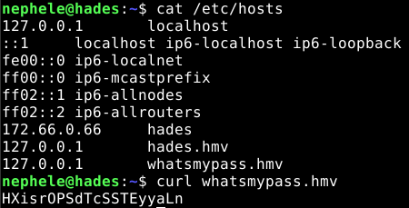

| user | password | flag
|------|----------|-----
|nyx|HXisrOPSdTcSSTEyyaLn|^BdYvJtfaTyfaliZPBkG^

# Mission 44
    
    ################
    # MISSION 0x44 #
    ################
    
    ## EN ##
    User pallas has her desktop tuned with conky.
    
    ## ES ##
    La usuaria pallas tiene su desktop tuneado con conky.

Conky is a system monitor software for the X Window System, Wayland and other things, too. I found that I can run `conky` as the user `pallas`.

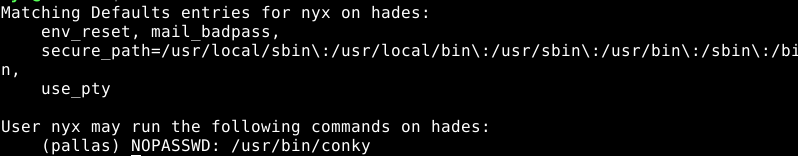

I use a custom config file to print the content of `/pwned/pallas/flagz.txt`

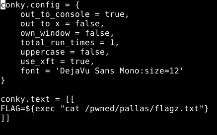

this config file made `conky` print the content of flagz.txt in the terminal once and then exit.

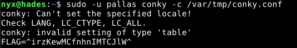

| user | password | flag
|------|----------|-----
|pallas|wWxyXnNbmjxNMEAIjbjT|^irzKewMCfnhnIMTCJlW^

# Mission 45

    ################
    # MISSION 0x45 #
    ################
    
    ## EN ##
    User pandora likes squares.
    
    ## ES ##
    A la usuaria pandora le gustan los cuadrados.

We can use `qrencode` to create a qr code of `/pwned/pandora/flagz.txt. Since we can run it as the user pandora.


using this commad ```bash sudo -u pandora qrencode -o /var/tmp/test.jpg -r /pwned/pandora/flagz.txt ```, I create the qr code and I downloaded it to my machine.


| user | password | flag
|------|----------|-----
|pandora|HhVHfmbBIiZbZSgcgadh|^pjDuPNQVgyhgigOIiwm^

# Mission 46

    ################
    # MISSION 0x46 #
    ################
    
    ## EN ##
    User penelope lets us do something...
    
    ## ES ##
    La usuaria penelope nos permite hacer algo...

I found two intersting files that belongs to `penelope`. The first one is the well knnown `getty` with setuid bit set and the other one is a simple text file that maybe it contains the password and we need to find a way to read it using `getty`


I used getty with the option -f to precise the issue file. I also mixed it with --show-issue to only show the content of issue and exit. 


| user | password | flag
|------|----------|-----
|penelope|anoRxVKulaoMNKMrddVe|^OGaiNcpusBXCHrDZjwN^

# Mission 47

    ################
    # MISSION 0x47 #
    ################
    
    ## EN ##
    If we give a username (user) and password (password) at http: //localhost/request.php, user phoebe may give us her password. 
    
    ## ES ##
    Si damos un usuario (user) y password (password) en http://localhost/request.php puede que phoebe nos de su password.

I used `find` to search for anyhting intersting. And I found that some users before me created two files : user.txt and pass.txt. They contain a list of previous owned users and their corresponding passwords. So basically they tried to bruteforcing.


I use this baah script to bruteforce the the user and pass. What it does is just lopping over the list of passwords and usernames if the web app returns anything rather than "NOTHING" we test if that password already in the pass.txt if not that's our potentail password.

```bash
#!/bin/bash

while read -r user; do
    while read -r pass; do

        response=$(curl -s "http://localhost/request.php?user=$user&password=$pass" | grep -v '^$')

        # If the response does not contain "NOTHING"
        if [[ "$response" != *"NOTHING"* ]]; then

            # Check if response exists exactly in pass.txt
            if ! grep -qxF "$response" pass.txt; then
                echo "$response"
                echo "$user : $pass"
                exit 0
            fi
        fi

    done < pass.txt
done < user.txt


```


I keep testing these passowrds until I found the right one.

| user | password | flag
|------|----------|-----
|phoebe|FPLwKmmKhcWAwRxiaBDN|^CrsphcuWGgjhlBYXhzQ^

# Mission 48

    ################
    # MISSION 0x48 #
    ################
    
    ## EN ##
    User rhea likes pictures.
    
    ## ES ##
    A la usuaria rhea le gustan las imagenes.


    
    


