# Mission 1

The initial credentials to connect to the machine

    Host: hades.hackmyvm.eu
    Port: 6666
    User: hacker
    Pass: begood!

Each time we will find a file `mission.txt` that gives us some what we need to in kind of puzzle.

    ################
    # MISSION 0x01 #
    ################

    ## EN ##
    User acantha has left us a gift to obtain her powers.

    ## ES ##
    La usuaria acantha nos ha dejado un regalo para obtener sus poderes.

I found also a file `readme.txt` that gives some informations like that the home of each user is in `/pwned/USER` and the file `flagz.txt` contain some kind of flag that we can insert in the official site to participate in the ranking.

From the content of `mission.txt` file we can assume that the next user is `acantha` and she left something for us that will give us her power. So let's first try `sudo -v` to see what we can run as who

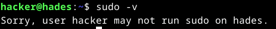

I tried to search for a file that contains the word `gift` in its name.

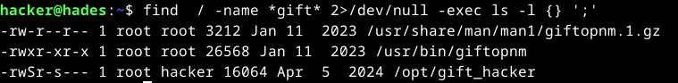

I found an executable file called `gift_hacker`, which I could run because I belong to the `hacker` group. After executing it, I obtained a shell with the **UID of `acantha`**. However, I could not access her home directory because the shell still had the **GID of `hacker`**.  

So I decided To search for all the files owned by `acantha`, I used the following command:

```bash
find / -user acantha -type f 2>/dev/null
```

This search revealed an interesting file: `/pazz/acantha_pass.txt`, which contained the password for acantha.

| user | password | flag
|------|----------|-----
| acantha|mYYLhLBSkrzZqFydxGkn|^CaEuVJtJjaCwZtuuAFD^

# Mission 2

    ################
    # MISSION 0x02 #
    ################

    ## EN ##
    The user alala has left us a program, if we insert the 6 correct numbers, she gives us her password!

    ## ES ##
    La usuaria alala nos ha dejado un programa, si insertamos los 6 numeros correctos, nos da su password!

The executable `guess` prompts for a PIN code. If the correct PIN is entered, it reveals the password for the user `alala`. if not, it simply returns *"No"   

To extract this password, we can either analyze the binary with a disassembler or the `strings` command

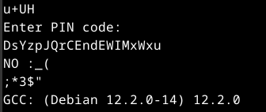

| user | password | flag
|------|----------|-----
| alala|DsYzpJQrCEndEWIMxWxu|^gTdGmkwhDrCqKrDQpxH^

# Mission 3

    ################
    # MISSION 0x03 #
    ################

    ## EN ##
    User althea loves reading Linux help.

    ## ES ##
    A la usuaria althea le encanta leer la ayuda de Linux.

We need to find a way to read the file `althea_pass.txt` that's belong to the user and group althea. We have an executable `read` when excuting it we get the manuel page of the man command. But wait we can run commands from the man pages 

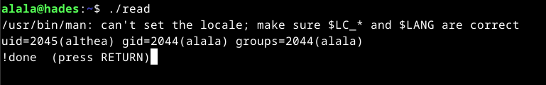

So `read` set the uid to that od the user `althea`. We can use that to read the file containing the password

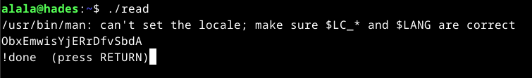

| user | password | flag
|------|----------|-----
| althea|ObxEmwisYjERrDfvSbdA|^btDtPAPzSiXmoHItpqX^

# Mission 4

    ################
    # MISSION 0x04 #
    ################
    
    ## EN ##
    The user andromeda has left us a program to list directories.
    
    ## ES ##
    La usuaria andromeda nos ha dejado un programa para listar directorios.
    
I found a program called `lsme`. According to mission.txt, it is supposed to list directories. However, I wasn't able to list `/pwned/andromeda/` due to insufficient permissions. This suggests that the program sets the **UID** to that of `andromeda`, but leaves the **GID** unchanged, which restricts full access to the directory.


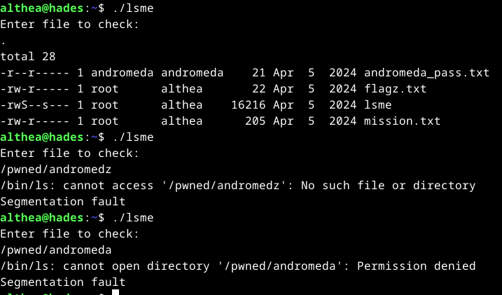

The program asks for an input and then passes it directly to the `ls` command. The issue is that no validation or sanitization is performed on the input, which allows us to chain additional commands and potentially execute arbitrary commands.

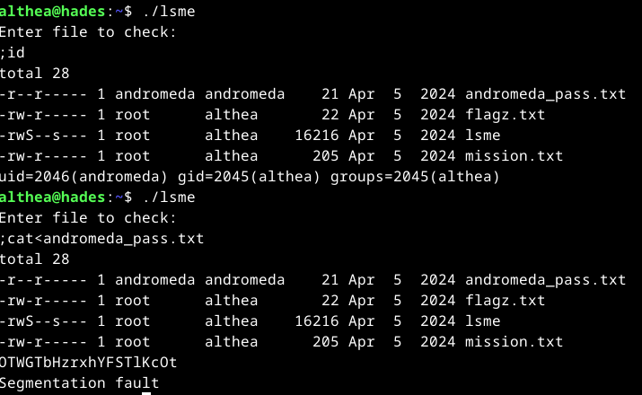

| user | password | flag
|------|----------|-----
| andromeda|OTWGTbHzrxhYFSTlKcOt|^xzsHGrOeNctIZLGKzWq^

# Mission 5

    ################
    # MISSION 0x05 #
    ################
    
    ## EN ##
    The user anthea reminds us who we are.
    
    ## ES ##
    La usuaria anthea procura que no olvidemos quien somos.

This time we have a program  called  `uid` executing it with parm or withou them returns the result of the `id` commmand with the uid set to anthea. We have also like before a file that contains the password for `anthea`. 

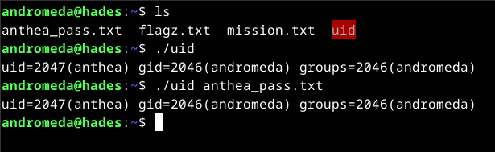

Since the program call the command `id`, I create a **symlink** to the command `/bin/bash` with the name `id` and I add the `/tmp` dir in the variable `PATH`. This gives a shell with the uid of `anthea`.

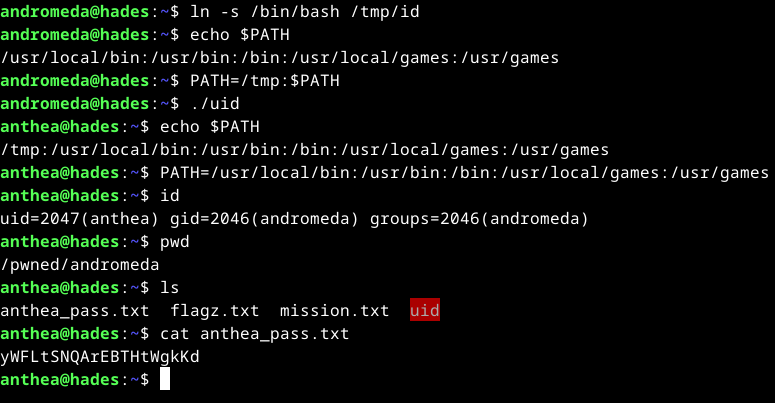

| user | password | flag
|------|----------|-----
| anthea|yWFLtSNQArEBTHtWgkKd|^AcFLuAjhydNKIkPoFLL^

# Mission 6

    ################
    # MISSION 0x06 #
    ################
    
    ## EN ##
    User aphrodite is obsessed with the number 94. 
    
    ## ES ##
    La usuaria aphrodite esta obsesionada con el numero 94.

The program `obsessed` has weird behaviour. It takes an input from the environement variable MYID and return weird output.

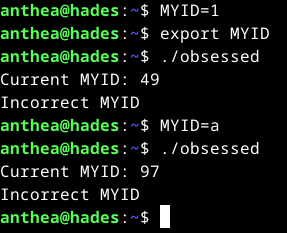

`strings` doesn't work. But it looks like it's about ascii(a encodes as 97 in ascii); so I need to put something that gives in ascii 94.

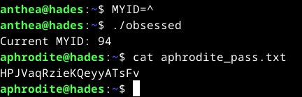

| user | password | flag
|------|----------|-----
| aphrodite|HPJVaqRzieKQeyyATsFv|^fmPlsDByrwmEpRAKgeP^

# Mission 7

    ################
    # MISSION 0x07 #
    ################
    
    ## EN ##
    The user ariadne knows what we keep in our HOME.

    ## ES ##
    La usuaria ariadne sabe que es lo que guardamos en nuestro HOME.

This program(`homecontent`) execute the following `/bin/ls $HOME`. So I use the variable HOME to chain commands.

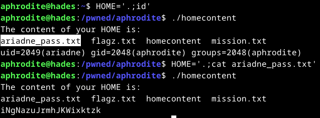

| user | password | flag
|------|----------|-----
| ariadne|iNgNazuJrmhJKWixktzk|^FuGFaFNhtKNxUInxAtd^

# Mission 8

    ################
    # MISSION 0x08 #
    ################
    
    ## EN ##
    The user arete lets us use cp on her behalf. 
    
    ## ES ##
    La usuaria arete nos deja usar cp en su nombre.

Using `sudo -l` I confirm the `mission.txt` statement

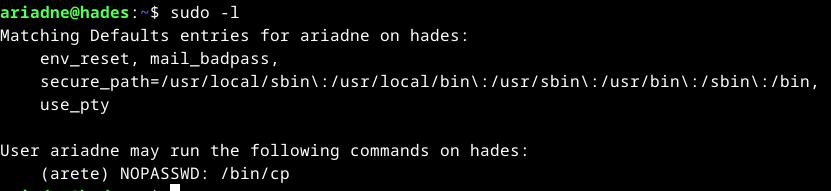

Now the task is clear and straightforward: access the home directory of `arete` and copy interesting files to a location where we have read permissions. The main question is what exactly needs to be copied. From previous missions, I know that in every home directory there is a file called `flagz.txt` which contains the flag (not the password). This is not an issue, since submitting the flag on the platform will reveal the corresponding password for that user.

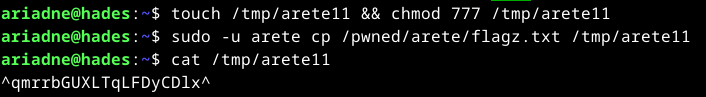

| user | password | flag
|------|----------|-----
|arete|QjrIovHacmGWxVjXRLmA|^qmrrbGUXLTqLFDyCDlx^

# Mission 9

    ################
    # MISSION 0x09 #
    ################
    
    ## EN ##
    The user artemis allows us to use some binary on her behalf. Its a gift... 
    
    ## ES ##
    La usuaria artemis nos permite usar algun binario en su nombre. Es un regalo...

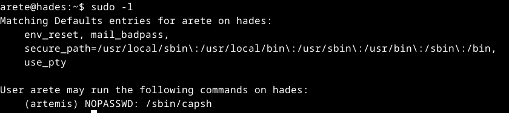

/sbin/capsh is a handy wrapper for certain types of  capability testing and environment creation

It can be used to run a command.

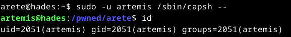

| user | password | flag
|------|----------|-----
|artemis|HIiaojeORLaJBVSPDDCZ|^SegGdzPgnNdGAmKjnsa^

# Mission 10

    ################
    # MISSION 0x10 #
    ################

    ## EN ##
    We need /bin/bash so that the user asia gives us her password. 

    ## ES ##
    Necesitamos /bin/bash para que la usuaria asia nos de su password.

When I run `restricted`, I directly obtain the password, but I’m not sure what the real purpose of this mission is. Maybe the idea is that I’m getting a regular Bash shell, while they actually expect us to spawn a different type of shell program.

| user | password | flag
|------|----------|-----
|asia|djqWtkLisbQlrGtLYHCv|^ngXdULWFWKCGtgxAQNv^

# Mission 11

    ################
    # MISSION 0x11 #
    ################

    ## EN ##
    The user asteria is teaching us to program in python. 

    ## ES ##
    La usuaria asteria nos esta enseñando a programar en python.

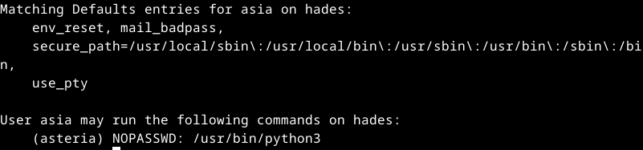

python is runnable as the user asteria. We can exploit this to spawn a shell as `asteria`.

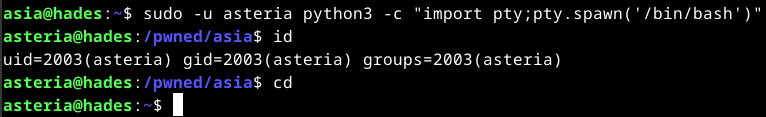

| user | password | flag
|------|----------|-----
|asteria|hawMVJCYrBgoDAMVhuwT|^xSRhIftMsAwWvBAnqNZ^

# Mission 12

    ################
    # MISSION 0x12 #
    ################

    ## EN ##
    The user astraea believes in magic. 

    ## ES ##
    La usuaria astraea cree en la magia.

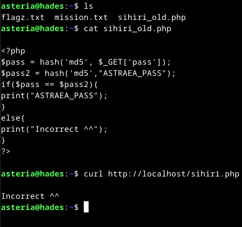

The challenge is based on a simple PHP application that compares the hash of the input provided in the `pass` parameter with the hash of the real password of `astraea`.  
If the two match, the application returns the password in cleartext.  

They also mentioned something about *magic*, which immediately made me think of the **magic hash attack**.  
This vulnerability occurs when PHP performs a *loose comparison* (`==` instead of `===`), allowing certain specially crafted hash values (like those starting with `0e...`) to be interpreted as `0` and thus bypass the check.

I found a repo that contains a list of strings that gives magic hashes (`md5("QLTHNDT")=0e405967825401955372549139051580`)

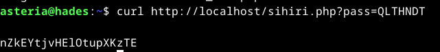


| user | password | flag
|------|----------|-----
|astraea|nZkEYtjvHElOtupXKzTE|^nqTHTzMzDPDJrKPCfVR^

# Mission 13

When trying to connect using ssh as the user `astraea`, the connection closed immediately.  
This means we need to look for another service running on the machine to connect to.

Since tools like `nmap`, `netstat`, or `ss` were not available, I decided to use a simple Python-based port scanner.  
I found one here: [ahervias77/portscanner.py](https://github.com/ahervias77/portscanner/blob/master/portscanner.py).

Here’s the scan in action:

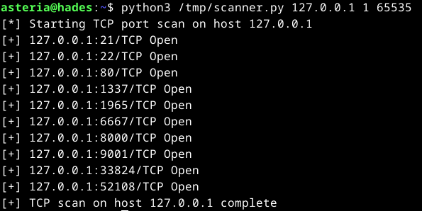

An FTP server is running on the machine.

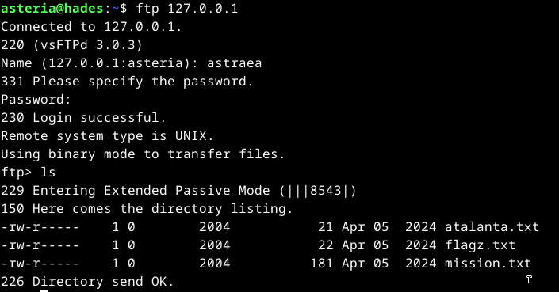

In the ftp server I found three files: the flag for the user `astraea`, the mission.txt and a file containing the password for the user `atalanta`.

    ################
    # MISSION 0x13 #
    ################

    ## EN ##
    The user atalanta has done something with our account. 

    ## ES ##
    La usuaria atalanta ha hecho algo con nuestra cuenta.


| user | password | flag
|------|----------|-----
|atalanta|mUcSNQlaXtwSvGcgeTYZ|^XXZbDJTQQWCHJWTGeOw^

# Mission 14

    ################
    # MISSION 0x14 #
    ################

    ## EN ##
    User athena lets us run her program, but she hasn't left us her source code.

    ## ES ##
    La usuaria athena nos deja ejecutar su programa, pero no nos ha dejado su codigo fuente.

The source code of the executable `weird` shows that the program simply dumps the content of `/var/lib/me` and writes it into the file specified by the environment variable `$HOME`. Then it checks the file’s owner, and if the owner is not the user `atalanta`, the program modifies its permissions by removing read access for both group and others while adding write access for the group.

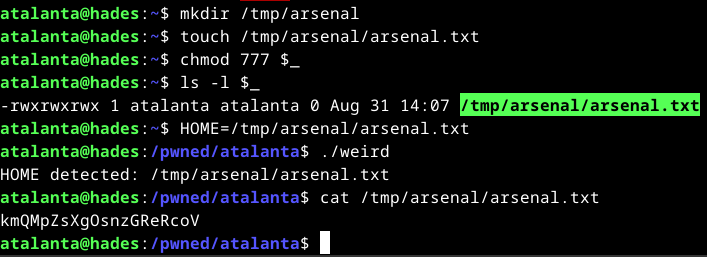

| user | password | flag
|------|----------|-----
|athena|kmQMpZsXgOsnzGReRcoV|^oGwmbNYdtHwJgznZdur^

# Mission 15

    ################
    # MISSION 0x15 #
    ################

    ## EN ##
    User aura lets us use her new script.

    ## ES ##
    La usuaria aura nos deja utilizar su nuevo script.

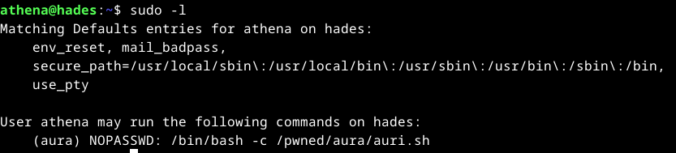

We can’t read the current script, but we were provided with an older version that gives us some insight into its behavior.

    #!/bin/bash
    echo "What?"
    read hackme
    #Secure the condition!
    #if [[ $hackme =~ "????????" ]]; then
    #exit
    #fi
    #Add newest Aura pass!
    #$hackme AURANEWPASS 2>/dev/null
    
The script prompts for an input, stores it in the `hackme` variable, and then performs a series of checks on it.


| user | password | flag
|------|----------|-----
|aura|TiqpedAFjwmVyBlYpzRh|^YFMNmPnlKNpnWiYOhYy^

the script seems to use this line `[[ $hackme == *"e"* || $hackme == *"o"* || $hackme == *"?"* ]]` to checks if the variable `hackme` contains the letter `e`, the letter `o`, or the character `?`.

# Mission 16

    ################
    # MISSION 0x16 #
    ################

    ## EN ##
    User aegle has a good memory for numbers.

    ## ES ##
    La usuaria aegle tiene buena memoria para los numeros.

The `number` program repeatedly prompts for a number, verifies it, and continues this process until eventually printing the password.

I use this script to bruteforce the numbers

```bash
#!/bin/bash

test=""
r=0

while true; do
    r=$((r+1))
    for i in $(seq 9); do
        count=$(echo -e "$test$i\n" | /pwned/aura/numbers | grep -c "OK")
        if [ "$count" -eq "$r" ]; then
            test="$test$i\n"
            echo "test = $test"
            break
        fi
   done
done
```
This Bash script builds a sequence of numbers one by one, feeding each candidate into `/pwned/aura/numbers` and appending it to the sequence only if the program returns the expected number of `"OK"` messages.

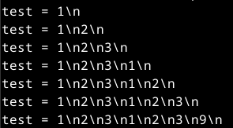

But the program stops at the number `9`. After debugging, I discovered that it behaves strangely when testing `1`: instead of returning a count of `8`, it returns `11`. After multiple attempts to resolve the issue, I modified the condition from `"$count" -eq "$r"` to `"$count" -ge "$r"`, allowing it to also match cases where the count is greater than `r`.

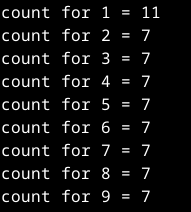

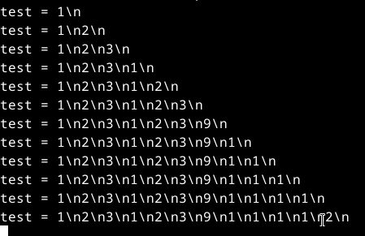

I got all the numbers except for the last one because, when entering the correct final number, the program returns the password instead of `"OK"` as it did for the previous numbers.

| user | password | flag
|------|----------|-----
|aegle|YRturIymmHSdBmEClEGe|^XCwOqgVvWpDVwPVVUJa^

# Mission 17 

    ################
    # MISSION 0x17 #
    ################

    ## EN ##
    User calliope likes to have her things looked at.

    ## ES ##
    A la usuaria calliope le gusta que le miren sus cosas.


| user | password | flag
|------|----------|-----
|aegle|IlhyWxZuqIHAuqVOpXfQ|^rFWOMwBJDidqSNtEJGJ^

# Mission 18 

    # Mission 18

    ################
    # MISSION 0x18 #
    ################

    ## EN ##
    The user calypso often uses write to communicate.

    ## ES ##
    La usuaria calypso suele usar write para comunicarse.

A program named `writeme` was identified. Upon execution, the following message appeared:

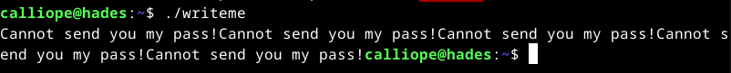

They something about `write`. The latter allows you to communicate with other users, by copying lines from your terminal to theirs. To permit incoming messages from other users, the command mesg y is executed.

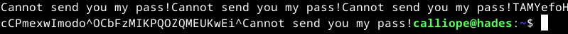

| user | password | flag
|------|----------|-----
|calypso|TAMYefoHcCPmexwImodo|^pssqdorRTYuTKuQBOYd^

# Mission 19 

    ################
    # MISSION 0x19 #
    ################

    ## EN ##
    User cassandra always wanted to be on TV.

    ## ES ##
    La usuaria cassandra siempre quiso salir en la TV.

The provided WAV file contained unusual audio. Analysis suggested the use of SSTV (Slow-Scan Television), a method for transmitting static images via radio. Decoding with an SSTV tool revealed the hidden content.

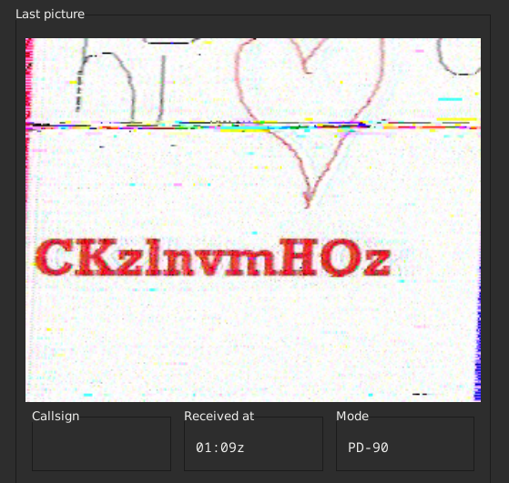

| user | password | flag
|------|----------|-----
|cassandra|CKzlnvmHQz|^lntvcYNlazEljOyZYKz^

# Mission 20

    ################
    # MISSION 0x20 #
    ################

    ## EN ##
    User cassiopeia sees the invisible. 

    ## ES ##
    La usuaria cassiopeia ve lo invisible.

The file here.txt contains Base64-encoded data. Decoding it produces incomplete text along with irregular white spaces. Upon further investigation, I discovered that the file likely uses whitespace steganography.

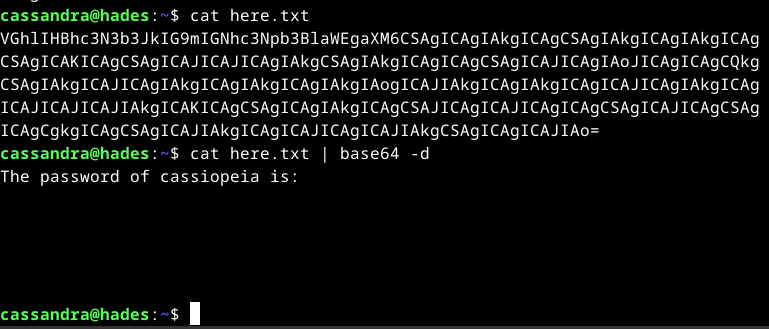

`stegsnow` is then used to extract the hidden data

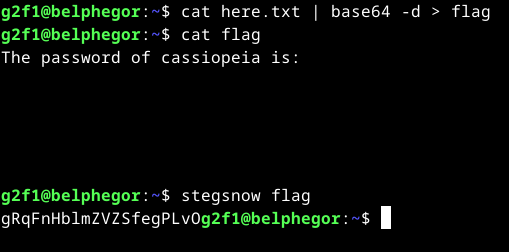


| user | password | flag
|------|----------|-----
|cassiopeia|gRqFnHblmZVZSfegPLvO|^GyWbcpEpqMsqMsjilzX^

# Mission 21

    ################
    # MISSION 0x21 #
    ################

    ## EN ##
    User clio hates spaces. 

    ## ES ##
    La usuaria clio odia los espacios.


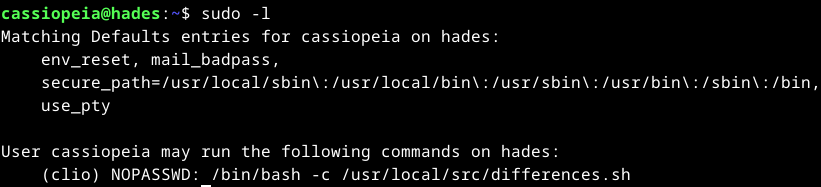

We have the read permission 

```bash 
#!/bin/bash
echo File to compare:!
read differences
IFS=0 read file1 file2 <<< "$differences"

if [[ "$differences" =~ \ |\' ]]
then
   echo "No spaces!!"
else
/usr/bin/diff $file1 $file2
fi
```

So instead of the default space IFS the program uses 0

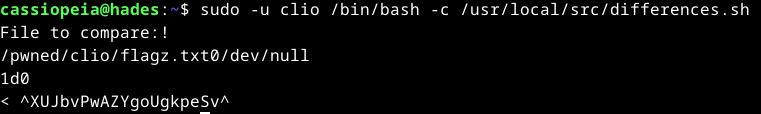

| user | password | flag
|------|----------|-----
|clio|cqJqRPaUtuoUYXbaxnZq|^XUJbvPwAZYgoUgkpeSv^

# Mission 22

    ################
    # MISSION 0x22 #
    ################

    ## EN ##
    The user cybele uses her lastname as a password.

    ## ES ##
    La usuaria cybele usa su apellido como password.

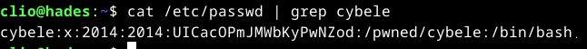


| user | password | flag
|------|----------|-----
|cybele|UICacOPmJMWbKyPwNZod|^bTsTIOmJELcaxEiIaCA^

# Mission 23

    ################
    # MISSION 0x23 #
    ################

    ## EN ##
    User cynthia sees things that others dont.

    ## ES ##
    La usuaria cynthia ve cosas que el resto no ven.

I discovered a PNG image and tested it with several steganography tools such as **steghide**, **binwalk**, and others, but none revealed any hidden data.  Finally, by analyzing it with [StegOnline](https://georgeom.net/StegOnline/upload) and inspecting the **bit planes**, I found the password hidden in the **Red 0** plane.  

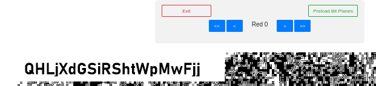


| user | password | flag
|------|----------|-----
|cynthia|QHLjXdGSiRShtWpMwFjj|^ZRSCKeYYlHkCEiHsEOI^

# Mission 24 

    ################
    # MISSION 0x24 #
    ################

    ## EN ##
    User daphne once told us: Gemini? gem-evil.hmv? WTF?

    ## ES ##
    La usuaria daphne nos dijo una vez: Gemini? gem-evil.hmv? WTF?

googling `gemini` and digging deeper to escape information about `gemini model from google`. I found out that Gemini is an application-layer internet communication protocol for accessing remote documents that uses port **1965** and similar to HTTP.

When scanning the target for open ports, I identified **1965**, which confirmed that the machine is running the **Gemini protocol**.

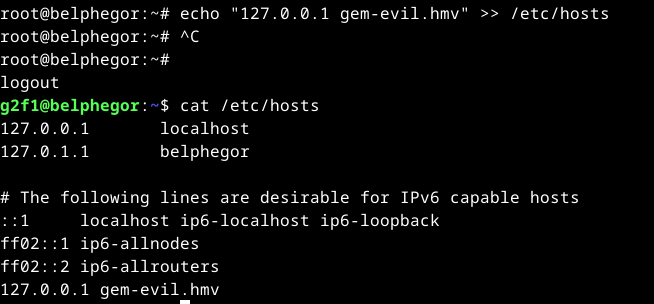

I use `ssh -p 6666 acantha@hades.hackmyvm.eu -L 1965:127.0.0.1:1965` to forward all requests from `localhost:1965` through SSH to `hades.hackmyvm.eu` on port `1965`.

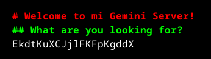

| user | password | flag
|------|----------|-----
|daphne|EkdtKuXCJjlFKFpKgddX|^ieOhnUKZlYZSSrIPgaJ^

# Mission 25

    ################
    # MISSION 0x25 #
    ################

    ## EN ##
    The user delia has a good memory, she only has to see her password for a few seconds to remember it.

    ## ES ##
    La usuaria delia tiene buena memoria, solo tiene que ver unos segundos su password para recordarlo.

```bash
#!/bin/bash
#OUTPUT="PASSWORD_DELIA" <-- UPDATE IT!
secretfile=$(mktemp /tmp/XXX)
chmod 664 "$secretfile"
exec 5>"$secretfile"
echo $OUTPUT >&5
sleep 0.01
rm "$secretfile"
```

This script briefly writes the password for the user `delia` into a temporary file, then deletes it almost immediately. The file’s name is generated with three random characters, so its exact name is unpredictable. Even if we try to read all files with three-character names in `/tmp`, the password won’t be found because the file is removed almost instantly.


